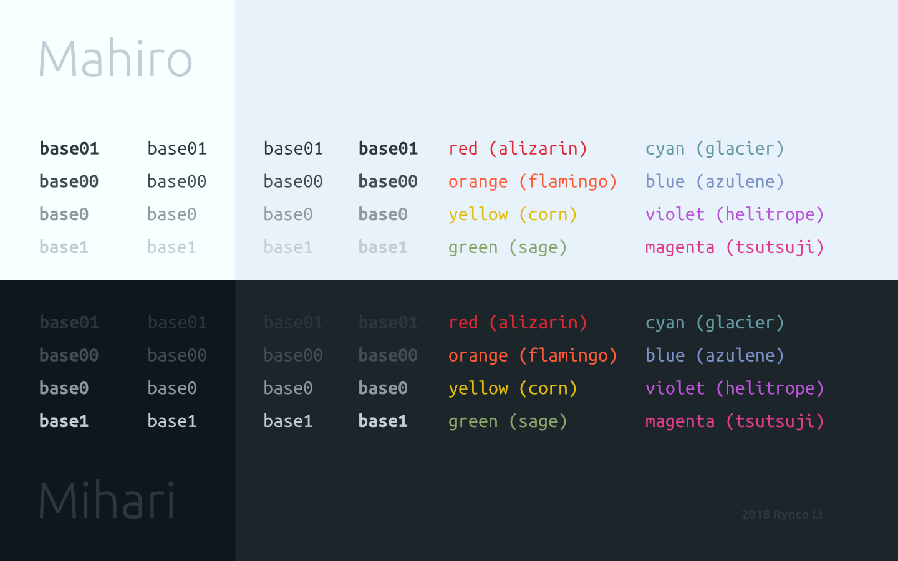
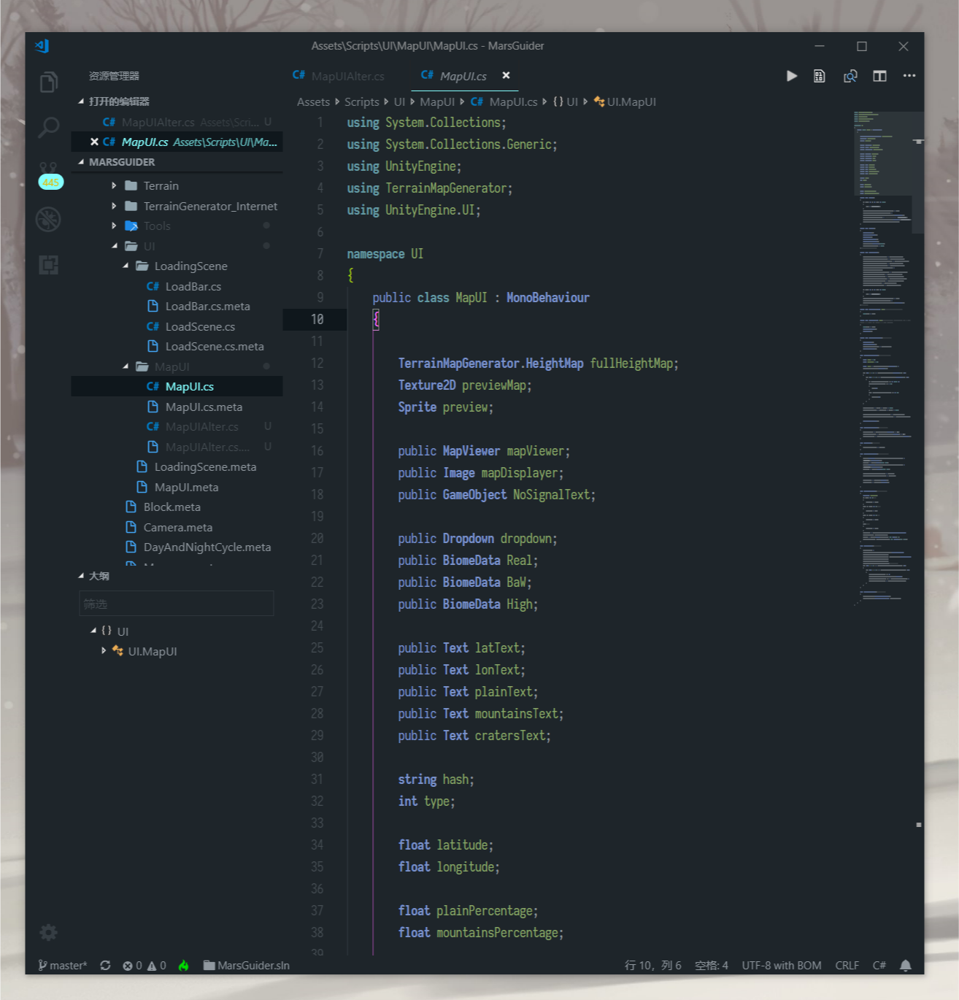

# Mihari & Mahiro Themes

Mihari and Mahiro are dark and light VSCode themes. Both themes fearture a
medium contrast and friendly colors. Borders of UI elements are by default
invisible.

[Github Repo](https://github.com/01010101lzy/mihari)

## Preview



Mihari



Previews for Mahiro coming Soon™

## Coloring

Both themes follow a solarized-style color swatch:

```
Name      Color      In dark theme    In light theme
----      ----       ----             ----

base3     #0F171C    dark bg          -
base2     #1E252A    bg               -
base1     #2E363C    light bg         highlight
base0     #454D53    comment/invalid  regular text
base00    #90989F    regular text     comment/invalid
base01    #C4CDD5    highlight        dark bg
base02    #E9F2FA    -                bg
base03    #F7FFFF    -                light bg

red       #E32636    error            error
orange    #FF5B35    -                warning
yellow    #E1BD09    warning          - (too bright)
green     #8BA66A    success          success
cyan      #649AA2    -                -
blue      #7B92C9    info             info
violet    #BA55D8    active           -
magenta   #DF3D8B    -                -
```

The colors are not as calculated as Solarized theme, but at lease they produces
a beautiful and balanced output.

## Naming

The names of these themes come from the manga _Onī-chan wa Oshimai! (Don't be an elder brother anymore!, お兄ちゃんはおしまい!)_ by NekoTōfu. **Mahiro** is the name of the main (fe)male character (Oyama Mahiro, 緒山 まひろ), while **Mihari** is the name of his younger sister (Oyama Mihari, 緒山 みはり).

More info on this manga at [Wikipedia (Chinese)](https://zh.wikipedia.org/wiki/%E5%88%AB%E5%BD%93%E6%AC%A7%E5%B0%BC%E9%85%B1%E4%BA%86%EF%BC%81), [Wikipedia (Japanese)](https://ja.wikipedia.org/wiki/%E3%81%8A%E5%85%84%E3%81%A1%E3%82%83%E3%82%93%E3%81%AF%E3%81%8A%E3%81%97%E3%81%BE%E3%81%84!), and [Pixiv](https://www.pixiv.net/user/159912/series/12).


